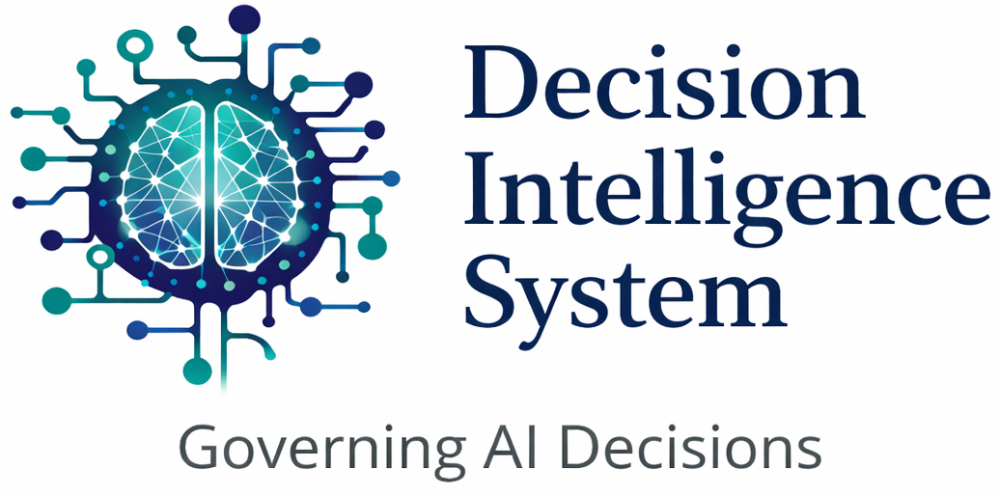

---

# Decision Intelligence System (DIS)

**Decision Intelligence System (DIS)** is a **governance-first AI platform** designed to ensure that every AI-assisted decision is **rule-validated, evidence-backed, auditable, and reproducible by design**.

The system demonstrates how enterprises can safely operationalize AI decisions by combining **deterministic governance controls** with **LLM-assisted reasoning**, without sacrificing explainability, traceability, or operational safety.

---

## Problem Statement

Modern AI systems can generate decisions at scale, but most enterprises struggle with:

- enforcing explicit rules and policies before execution  
- explaining *why* a decision was made  
- auditing and replaying past decisions  
- defending AI decisions in regulated or high-stakes environments  

DIS addresses this gap by treating **decision governance as a first-class system concern**, not an afterthought.

---

## Core Design Principles

- **Governance-First**: No decision executes without explicit validation against rules and policies.

- **Deterministic Control**: Rules, thresholds, and precedence logic always take priority over probabilistic outputs.

- **Explainability by Design**: Decisions are accompanied by structured reasoning and supporting evidence.

- **Auditability & Replayability**: Every decision produces an audit trail that can be inspected or replayed.

- **Production-Oriented Architecture**: Designed as a deployable cloud system, not a research prototype.

---

## Repository Structure (Monorepo)

decision-intelligence-system/
<table>
  <thead>
    <tr>
      <th>#</th>
      <th>Subrepository</th>
      <th>Description</th>
    </tr>
  </thead>
  <tbody>
    <tr>
      <td>1</td>
      <td><code>dis-ingestion/</code></td>
      <td>Handles raw input ingestion, schema validation, and normalization before downstream processing.</td>
    </tr>
    <tr>
      <td>2</td>
      <td><code>dis-signal-processing/</code></td>
      <td>Performs deterministic signal enrichment, scoring, aggregation, and pre-decision validation.</td>
    </tr>
    <tr>
      <td>3</td>
      <td><code>dis-reasoning/</code></td>
      <td>Implements decision reasoning, rule evaluation, precedence logic, and governance enforcement.</td>
    </tr>
    <tr>
      <td>4</td>
      <td><code>dis-api/</code></td>
      <td>Exposes the core Decision API; orchestrates governance, reasoning, and audit generation. This is the deployable runtime service.</td>
    </tr>
    <tr>
      <td>5</td>
      <td><code>dis-decision-console/</code></td>
      <td>Provides an optional inspection and visualization console for reviewing decisions, traces, and audit artifacts.</td>
    </tr>
  </tbody>
</table>

> The system is organized as a **monorepo for clarity and reviewability**, while runtime components are deployed independently where appropriate.

---

## High-Level Decision Lifecycle

1. **Ingest** structured inputs and contextual signals  
2. **Normalize & enrich** signals deterministically  
3. **Validate** against governance rules and policies  
4. **Reason & decide** with explainable outputs  
5. **Audit & persist** all decision artifacts for replay  

---

## Deployment Architecture

DIS follows a **hybrid cloud execution model**. Here is a **point-wise, concise, README-ready version**, optimized for quick scanning:

* **Cloud:** AWS
* **Ingestion:** Amazon S3 triggers **Lambda** for input validation and normalization
* **Signal Processing:** **Lambda** for deterministic transformation, validation, and preparation
* **Reasoning Engine:** **ECS Fargate** for core decision execution and governance
* **API & Console:** **Lambda** for decision APIs and inspection console
* **Data Stores:** **RDS (PostgreSQL)** for relational data, **DynamoDB** for execution state
* **Analytics:** **Athena** for audit and historical analysis
* **Observability:** **CloudWatch** for logs, metrics, and alarms
* **Security & Config:** **IAM**, **Secrets Manager**, **Systems Manager (SSM)**

> Monorepo is for humans. Runtime units are for machines.

---

## What This Project Focuses On

- AI decision governance patterns  
- Explainability and auditability by design  
- Production-grade system architecture  
- Safe AI execution in enterprise environments  

## What This Project Intentionally Avoids

- Model training or fine-tuning  
- Domain-specific business logic  
- Experimental or research-oriented ML work  

---

## Example Use Cases

- Enterprise AI decision governance  
- Compliance and approval workflows  
- Risk and policy enforcement layers  
- Explainable AI execution pipelines  

---

## Disclaimer

*This repository is an **independently developed portfolio project**, created to demonstrate **system architecture and decision governance design patterns**.
It does **not** contain proprietary code, data, or implementations from any employer or client, not even open source projects*

---

## Author

**Bhagwat Chate**  
AI Systems · Decision Intelligence · Governance-First Architectures
